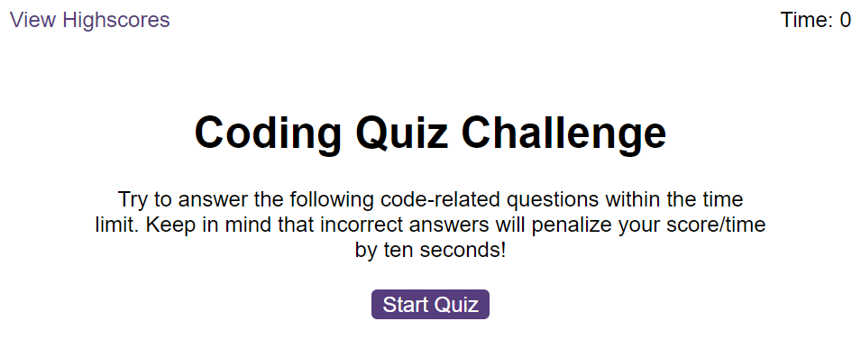
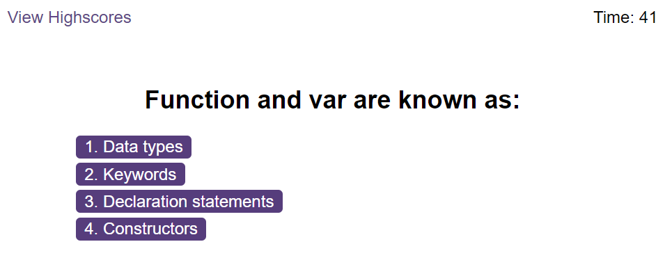
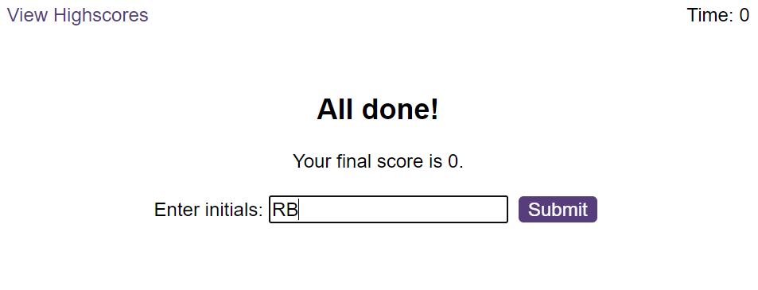
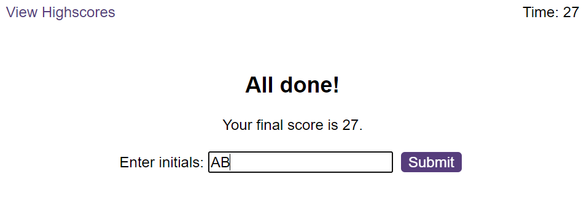
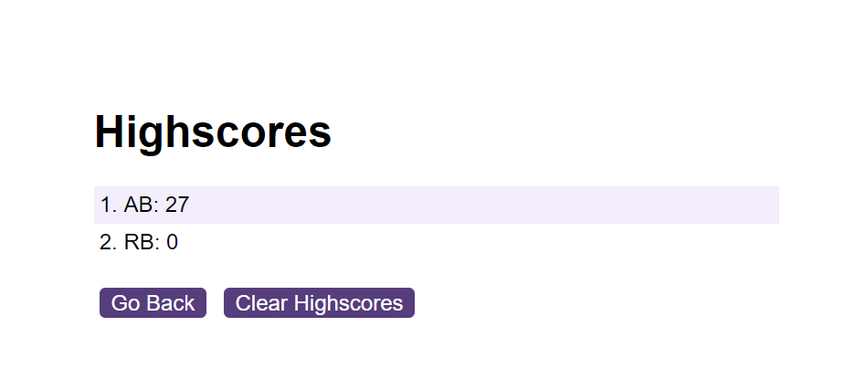

# javascript-quiz

## Description

JavaScript application to help Junior Web Developers become more familiar with multiple choice questions that could get asked during coding assessment stage of the inteviewing process.

* When start button is clicked timer starts and presents question to user
* Once current question is answered the next question is presented
* Time is deducted if question is answered incorrectly
* Score saved as time remaining on the clock
* Saves user highscore to local storage

## Installation

N/a

## Usage

[Access JavaScript Quiz application](https://rbenameur.github.io/javascript-quiz "Link to deployed github page")

In order to commence the quiz click the 'Start Quiz' button.

Click on one of the four options to answer the question. If the response is incorrect 10 seconds is deducted from the timer.

If all questions answered incorrectly, or user runs out of time the score will be zero.

If all questions answered correctly, time left on the timer is saved as the score.

By clicking submit, the highscore is saved to local storage and the webpage is reset to the landing page. The highscore can be viewed by clicking the 'View Highscores' link which redirects user to highscores page. The user can navigate back to the quiz or clear storage by clicking 'Go Back' or 'Clear Highscores' respectively

## Credits

N/a

## License

Please refer to the LICENSE in the repo.
